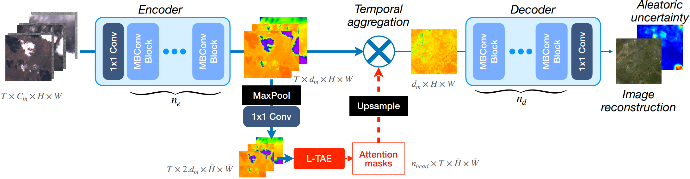

# UnCRtainTS: Uncertainty Quantification for Cloud Removal in Optical Satellite for INDONESIA_URBAN_MSCR



## Installation
### Code
Clone this repository via `git clone https://github.com/AngryCloudEver/uncrtaints-indonesia_urban_mscr.git`.

and set up the Python environment via 

```bash
conda env create --file environment.yaml
conda activate uncrtaints
```

Alternatively, you may install all that's needed via 
```bash
pip install -r requirements.txt
```
or by building a Docker image of `Dockerfile` and deploying a container.

The code is written in Python 3 and uses PyTorch $\geq$ 2.0. It is strongly recommended to run the code with CUDA and GPU support. The code has been developed and deployed in Ubuntu 20 LTS and should be able to run in any comparable OS.

---

## Inference Usage
-Patch Your .tif Files into 256*256 pixels using patch_file.py
-Copy the Cloudy Folder of patch results and rename it into Sentinel-2-CloudFree (not used but needed)
-Change the path value on the test part of parse_args.py (res_dir and root4)
-Run the test_full_reconstruct.py to begin infering
-Combine back the infering results with combine.py (don't forget the redefine your width and height)

## Credits

This code was originally based on the [UTAE](https://github.com/VSainteuf/utae-paps) and the [SEN12MS-CR-TS](https://github.com/PatrickTUM/SEN12MS-CR-TS) repositories. Thanks for making your code publicly available! We hope this repository will equally contribute to the development of future exciting work.
